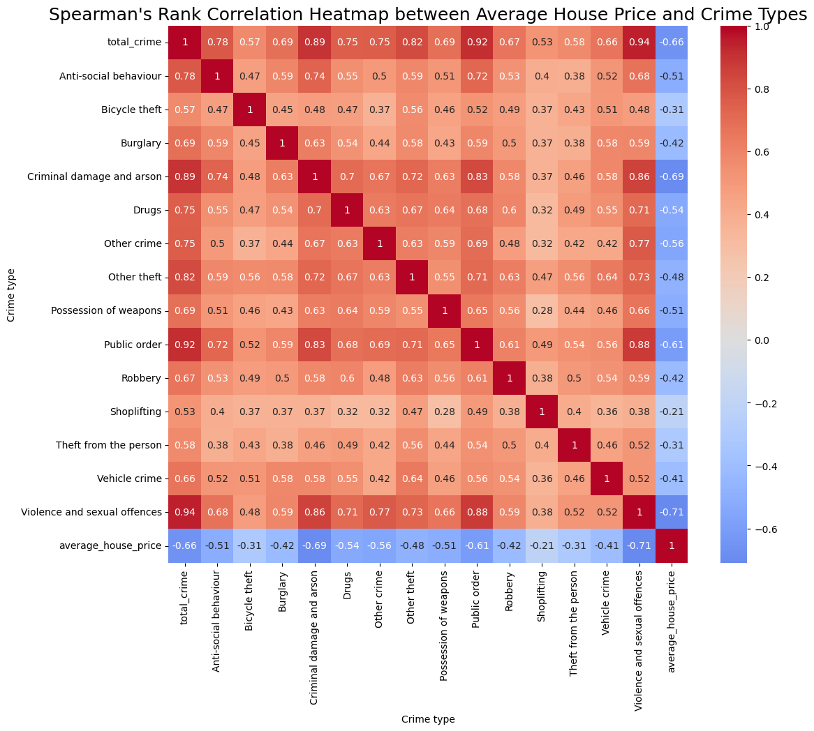
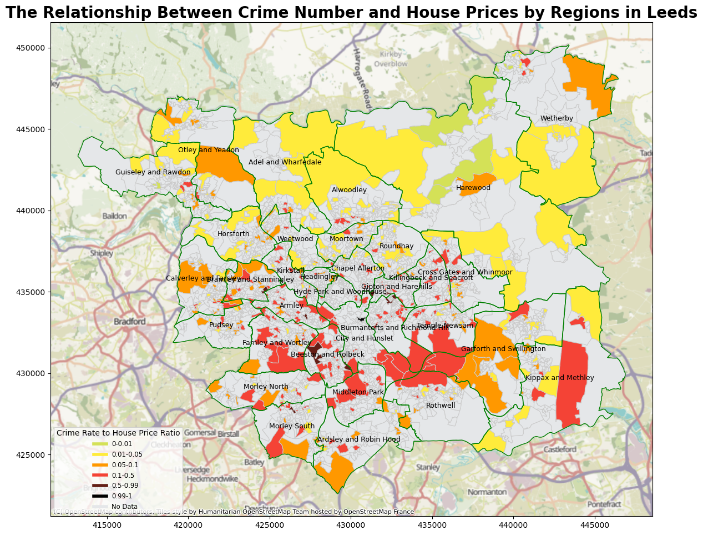

# GEOG5990M_Final_Project
## Background
The price factors influencing housing prices are diverse, encompassing transportation infrastructure, geographical elements, and the level of public safety. An essential indicator reflecting public safety is the quantity of criminal cases. In this endeavor, our project aims to investigate the relationship between housing prices and the incidence of criminal cases in the Leeds area through data visualization.

## Data
The dataset utilized in the code comprises four distinct sets:  
2023_crime_data_west_yorkshire.csv  
house_price_by_LSOA.xls  
map_leeds.gpkg  
oa_leeds.gpkg  

Due to the size limit of the dataset, I couldn't upload it to GitHub. Therefore, I have uploaded all the data to OneDrive. The download link is as follows:  
https://1drv.ms/u/s!AlAOIOBwskGHwXnGmkTmMhNkQ_vd?e=1CaSRy  

## Code
All of the code is contained in G5990M_201749866.ipynb, including detailed processes such as data preprocessing, data merging, and plotting. The code includes detailed comments on the process flow, and below are two graphs generated based on the aforementioned four datasets.  
### Non-spatial visualization  

### Spatial visualization  

